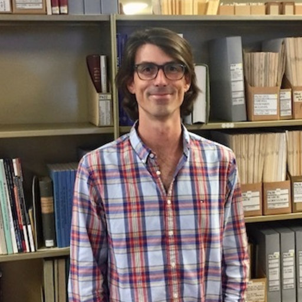
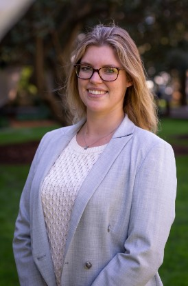

# Genomics Aotearoa High Quality Genomes researcher profiles

## Natalie Forsdick

Affiliation: Manaaki Whenua - Landcare Research

Location: Tāmaki Makaurau

Genomics Aotearoa research project(s):
1) Reference genome assemblies for:
- Kakī | Black stilt, *Himantopus novaezelandiae*
- Kuaka Whenua Hou | Whenua Hou diving petrel, *Pelecanoides whenuahoensis*
- Huhu beetle, *Prionoplus reticularis*
- Little Barrier giant wētā, *Deinacrida heteracantha*
- Rātā moehau | Bartlett's rātā, *Meterosideros bartletti*
- Hochstetter's frog, *Leiopelma hochstetteri*
    
2) Population genomics:
    
- Mahoenui giant wētā, *Deinacrida mahoenui*
- Kuaka Whenua Hou
    
Start date: 2020-11-01

Find me at: forsdickn@landcareresearch.co.nz, https://github.com/natforsdick, Twitter: @NatForsdick, Mastodon: @NatForsdick@ecoevo.social 

Talk to me about: Birds! As Vice-President of [Birds NZ](www.birdsnz.org.nz), you will often find me bird-watching in my free time. 

## Annabel Whibley

Affiliation: Bioinformatician at Bragato Research Institute and honorary academic at the University of Auckland 

Location: Tāmaki Makaurau

Genomics Aotearoa research project(s):

Reference genome assemblies and population genomics of  Hihi | Stitchbird, *Notiomystis cincta*

Other NZ genomics research projects:
1) Myna and Starling invasion genomics
2) Grapevine genomics, including a T2T assembly of sauvignon blanc and large-scale population genotyping.

Find me at: annabel.whibley@bri.co.nz or annabel.whibley@auckland.ac.nz , https://github.com/annabel-NZ Twitter:@alt_allele

Talk to me about: Genome assemblies, non-model organisms, transposons, wet-lab approaches, experimental design and anything ONT.

## Ignacio Carvajal

Affiliation: Plant & Food Research 

Location: Tāmaki Makaurau

Genomics Aotearoa research project(s): *Vaccinium spp.*, *Centrostephanus rodgersii*, *Leioproctus imitatus* and *Ecklonia radiata*

Find me at: ignacio.carvajal@plantandfood.co.nz or  [Github](https://github.com/ignacio3437)

Talk to me about: Hi-C, wet-lab hacks, genome assembly, phylogenetics, taxonomy and population genetics. 

## Katarina Stuart

Affiliation: University of Auckland, and visiting fellow at the University of New South Wales

Location: Auckland

Genomics Aotearoa research project(s): Hihi whole genome resequencing & myna genomics (non GA project)

Find me at: katarina.stuart@auckland.ac.nz | katarina.stuart@unsw.edu.au | https://katarinastuart.github.io/ | @Katarina_Stuart

Talk to me about: population & evolutionary genomics, board games, lizards