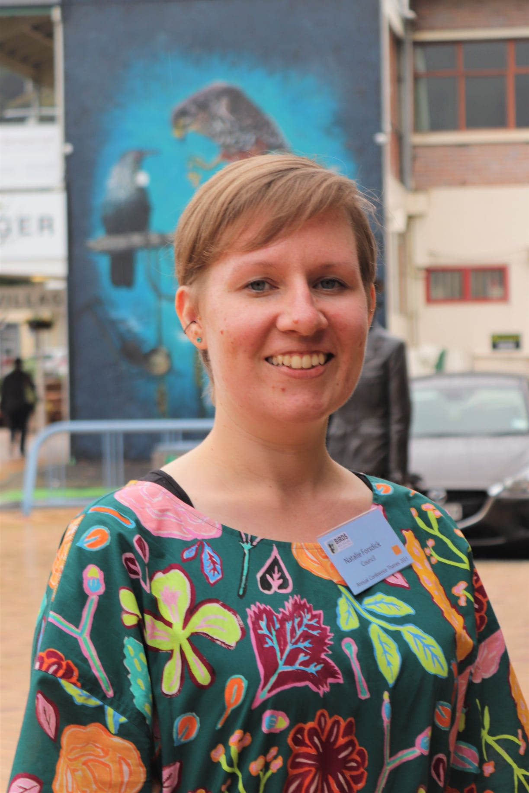

# Genomics Aotearoa High Quality Genomes researcher profiles

## Natalie Forsdick

Affiliation: Manaaki Whenua - Landcare Research

Location: Tāmaki Makaurau

Genomics Aotearoa research project(s):
1) Reference genome assemblies for:
- Kakī | Black stilt, *Himantopus novaezelandiae*
- Kuaka Whenua Hou | Whenua Hou diving petrel, *Pelecanoides whenuahoensis*
- Huhu beetle, *Prionoplus reticularis*
- Little Barrier giant wētā, *Deinacrida heteracantha*
- Rātā moehau | Bartlett's rātā, *Meterosideros bartletti*
- Hochstetter's frog, *Leiopelma hochstetteri*
    
2) Population genomics:
    
- Mahoenui giant wētā, *Deinacrida mahoenui*
- Kuaka Whenua Hou
    
Start date: 2020-11-01

Find me at: forsdickn@landcareresearch.co.nz, https://github.com/natforsdick, Twitter: @NatForsdick, Mastodon: @NatForsdick@ecoevo.social 

Talk to me about: Birds! As Vice-President of [Birds NZ](www.birdsnz.org.nz), you will often find me bird-watching in my free time. 
