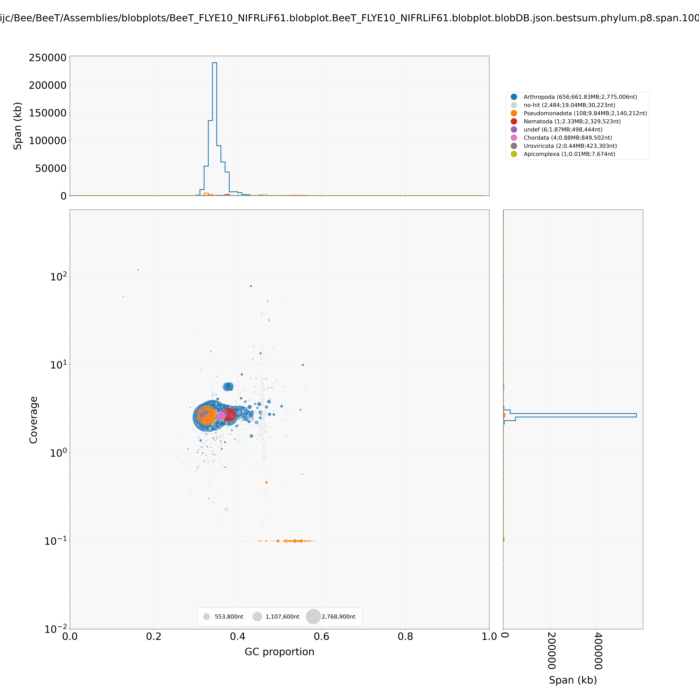
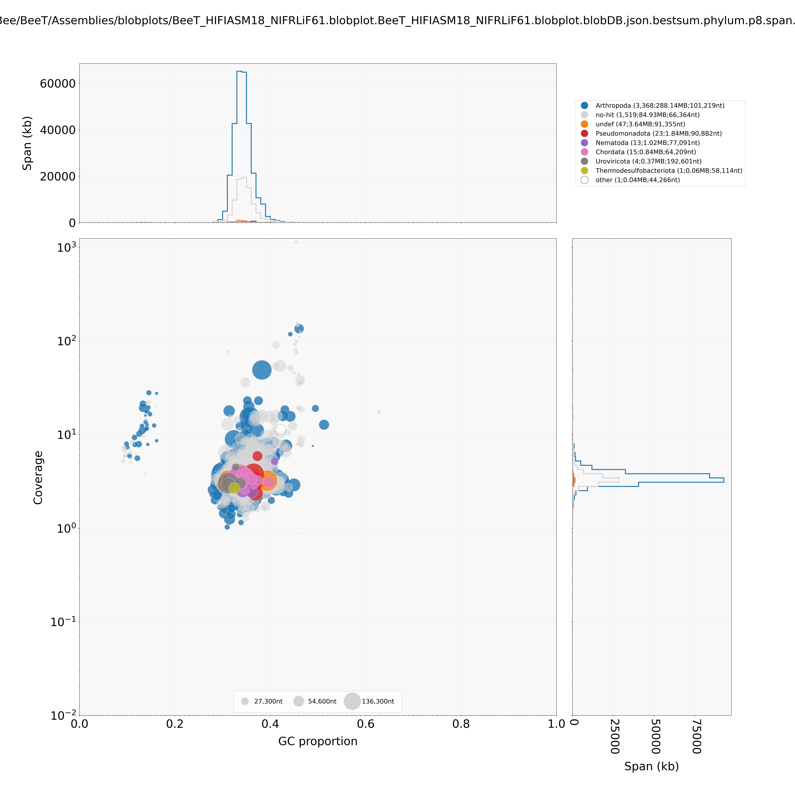

# Assembly of *Leioproctus imitatus* genome

## Input data:
1. R 10.4 ONT run of gDNA from thorax tissue. May have some microbial contamination. This is what was used for the assembly. (**BeeT**)
2. Illumina data from a L. imitates individual from head tissue. Was not used in the assembly but was used as a check to compare to the thorax tissue assembly.

## Assemblies:
1. I tried several filtering cut-offs on the ONT data and assembled with FLYE. The most contiguous assembly was generated using >Q10 data, a relatively relaxed filter. All of the FLYE assemblies were >600MB. (**FLYE10**)
2. I also tried a few input subsets on HiFIASM. These assemblies were less contiguous than the FLYE assemblies and ~350MB. The best assembly was generated with >Q18 and >2kb read filters. (**HIFIASM18**)

## Filtering the contigs from the Assembly:
1. I created blobplots of the best FLYE and HiFiasm assemblies. Note: I used the illumina data to calculate coverage. On the FLYE blobplot we reassuringly see that the contigs from the thorax assembly that were blasting to microbes have no coverage in the illumina data that came from head tissue. The Hifiasm blobplot is weird…. Don’t know what’s going on there, especially with the low GC contigs.
2. Based on the blobplot results I filtered the contigs (**bfil**):
- - FLYE:  Kept all the of Arthropoda hits, then of the non-Arthropoda contigs I removed any contigs with <2x coverage in the illumina data, >0.4 % GC, contigs shorter than 5kbp. 
- - HIFIasm: I just kept the Arthropoda hits, no other filtering. 

## Purged haplotigs using purge_dups (**.purged**) 
1. I tried using the Q10, Q15 ONT data and there is an option to include the illumina data too so I tried that. There was no big difference between them so I used the Q10 purge_dups assemblies. 

## Assembly metrics:
| n_contigs 	| contig_bp 	| ctg_N50 	| ctg_L50 	| ctg_N90 	| ctg_L90 	| ctg_max  	| gc_avg  	| filename                         	| Busco                                         	|   	|   	|   	|   	|   	|   	|   	|   	|   	|   	|
|-----------	|-----------	|---------	|---------	|---------	|---------	|----------	|---------	|----------------------------------	|-----------------------------------------------	|---	|---	|---	|---	|---	|---	|---	|---	|---	|---	|
| 3262      	| 696244996 	| 79      	| 2696791 	| 308     	| 449130  	| 11075509 	| 0.35009 	| BeeT_FLYE10.fasta                	|                                               	|   	|   	|   	|   	|   	|   	|   	|   	|   	|   	|
| 821       	| 679462663 	| 76      	| 2766627 	| 279     	| 574703  	| 11075509 	| 0.34787 	| BeeT_FLYE10_bfil.fasta           	|                                               	|   	|   	|   	|   	|   	|   	|   	|   	|   	|   	|
| 652       	| 673910815 	| 75      	| 2770209 	| 270     	| 589332  	| 11075509 	| 0.3478  	| BeeT_FLYE10_bfil.purged.fasta    	| C:98.9%[S:98.6%,D:0.3%],F:0.2%,M:0.9%,n:1367  	|   	|   	|   	|   	|   	|   	|   	|   	|   	|   	|
| 4993      	| 380881427 	| 1364    	| 92058   	| 3749    	| 42794   	| 545116   	| 0.3438  	| BeeT_HIFIASM18.fasta             	| C:69.5%[S:66.0%,D:3.5%],F:1.5%,M:29.0%,n:1367 	|   	|   	|   	|   	|   	|   	|   	|   	|   	|   	|
| 3368      	| 288138445 	| 939     	| 101219  	| 2557    	| 48153   	| 545116   	| 0.34288 	| BeeT_HIFIASM18_bfil.fasta        	|                                               	|   	|   	|   	|   	|   	|   	|   	|   	|   	|   	|
| 3165      	| 275812870 	| 882     	| 103454  	| 2408    	| 48353   	| 545116   	| 0.34311 	| BeeT_HIFIASM18_bfil.purged.fasta 	| C:66.8%[S:65.8%,D:1.0%],F:1.5%,M:31.7%,n:1367 	|   	|   	|   	|   	|   	|   	|   	|   	|   	|   	|
|           	|           	|         	|         	|         	|         	|          	|         	|                                  	|                                               	|   	|   	|   	|   	|   	|   	|   	|   	|   	|   	|
## Assembly file:
1. Please use BeeT_FLYE10_bfil.purged.fasta [found here](https://storage.powerplant.pfr.co.nz/workspace/hraijc/Bee/BeeT/Assemblies/OUTPUT/BeeT_FLYE10_bfil.purged.fasta)

## BlobPlots:

### BeeT_FLYE10

### BeeT_HiFiasm18

